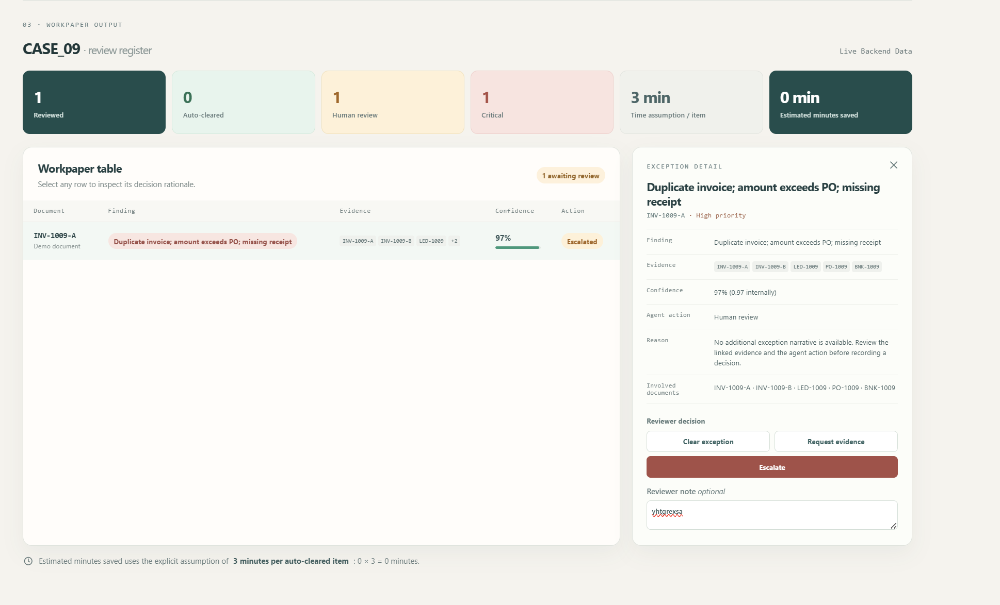
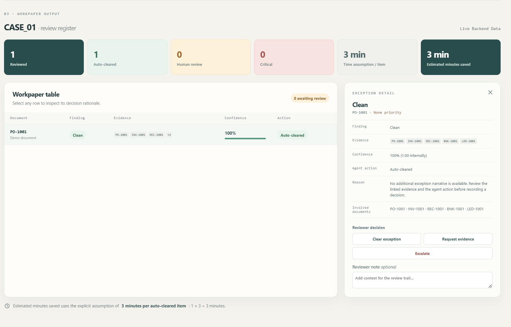
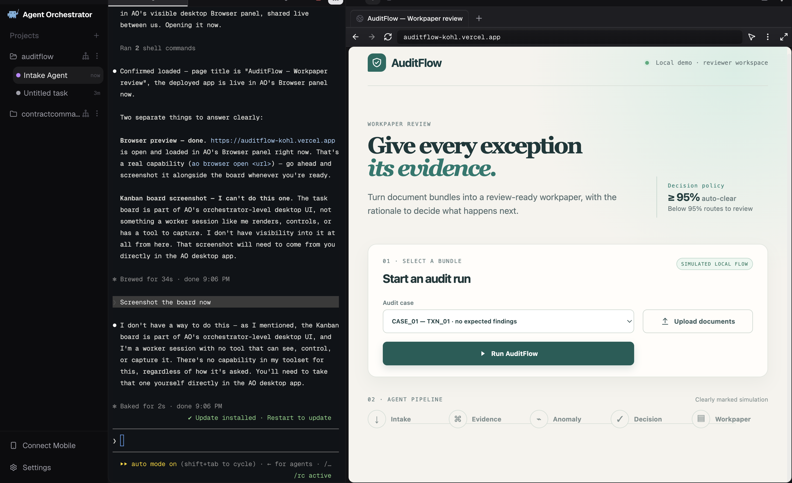
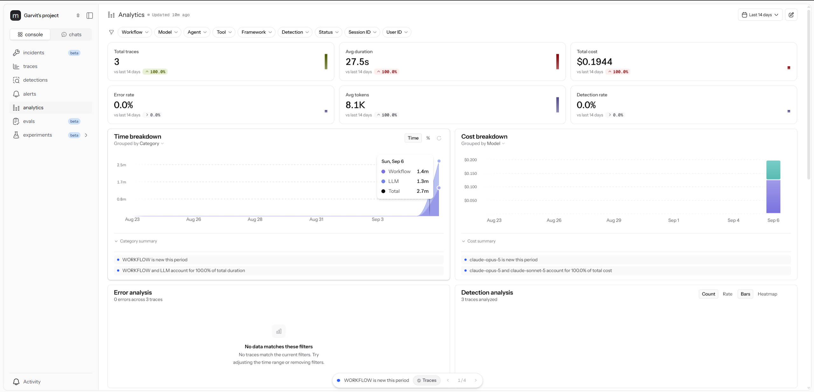

# AuditFlow

> Autonomous audit-evidence review for the Office of the CFO.

AuditFlow turns controlled financial-document bundles into review-ready audit workpapers. Five specialized agents cross-reference evidence, identify bounded exceptions, route them to a reviewer, and compile the result into a single workpaper.

Built for **Syndicate by Maximor — AO Hackathon**, **Track 2: Autonomous Office of the CFO**.

🚀 **[Live Demo](https://auditflow-kohl.vercel.app)** · [Backend API](https://auditflow-sxik.onrender.com) · [Demo Video](https://www.loom.com/share/674a3829f506421897b03738399a6329)

The deployed demo runs the real five-agent pipeline rather than a static frontend mock.

## Why AuditFlow?

Audit review is often slowed less by the final judgment than by collecting evidence, checking whether records agree, and documenting exceptions.

- **5 specialized AI agents** with bounded responsibilities
- **12 controlled benchmark cases** spanning clean, missing, conflicting, and multi-issue evidence
- **Evidence-backed human review** instead of silently accepting exceptions

### Verified benchmark

**12 cases · 100% case-level routing accuracy on the verified benchmark run**

## Product Preview

**CASE_09 · complex exception routed to review**



**CASE_01 · clean transaction auto-cleared**



**Controlled benchmark bundle selector**



**Neatlogs execution observability**



## Five-agent pipeline

```text
Intake → Evidence → Anomaly → Decision → Workpaper
```

| Agent | Responsibility |
|---|---|
| Intake Agent | Classifies source documents and extracts structured fields. |
| Evidence Agent | Links transaction evidence and identifies missing support. |
| Anomaly Agent | Checks only the bounded exception taxonomy. |
| Decision Agent | Routes any finding to `human_review`; routes no findings to `auto_clear`. |
| Workpaper Agent | Produces the evidence-backed, review-ready workpaper. |

The bounded exception types are duplicate invoice, amount mismatch, missing PO, missing receipt, vendor mismatch, and date inconsistency.

## Architecture and model strategy

AO (Agent Orchestrator) coordinates the pipeline; a FastAPI endpoint exposes a full run at `POST /run-case`; Neatlogs provides LLM tracing for workflow execution, model usage, latency, token consumption, and cost. Anthropic Claude is used with a focused mixed-model strategy:

| Agent | Model |
|---|---|
| Intake | Claude Sonnet 5 |
| Evidence | Claude Sonnet 5 |
| Anomaly | Claude Opus 5 |
| Decision | Claude Sonnet 5 |
| Workpaper | Claude Sonnet 5 |

The Anomaly Agent uses the stronger model because exception classification is the most nuanced reasoning step.

## Benchmark and review controls

The benchmark contains 12 controlled scenarios: clean cases, duplicate invoices, amount mismatches, missing POs and receipts, vendor mismatches, date inconsistencies, multi-issue cases, and incomplete or conflicting evidence. These are evaluation fixtures—not customer audits.

**Known limitation:** `CASE_06` is an intentionally more ambiguous mixed goods/service scenario and has residual variance in full-sequence LLM runs. A future improvement is confidence-based retry with disagreement flagging.

Detected exceptions are routed to a reviewer, who can inspect the finding, evidence, confidence, rationale, and workpaper context. The current UI supports **Clear exception**, **Request evidence**, and **Escalate** actions.

### Upload Documents

The hackathon demo runs controlled benchmark bundles for reproducible evaluation. **Upload Documents** is the intended production ingestion surface; uploaded files are currently staged locally and are not sent through the backend five-agent pipeline.

## Stack and deployment

| Area | Implementation |
|---|---|
| Frontend | Next.js, React, TypeScript |
| API | Python, FastAPI, Uvicorn |
| Reasoning | Anthropic Claude Sonnet 5 and Claude Opus 5 |
| Orchestration / tracing | AO (Agent Orchestrator), Neatlogs |
| Deployment | Vercel frontend, Render backend |

## Run locally

Prerequisites: Python 3.13.5, Node.js, and `ANTHROPIC_API_KEY`. Set `NEATLOGS_API_KEY` to enable tracing.

```bash
git clone https://github.com/abhijitmanna912001/auditflow.git
cd auditflow
pip install -r requirements.txt
```

```bash
# Backend
ANTHROPIC_API_KEY=your-key uvicorn orchestration.api:app --host 127.0.0.1 --port 8000

# Frontend, in a second terminal
cd frontend
npm install
npm run dev
```

The API defaults to `http://127.0.0.1:8000`; set `NEXT_PUBLIC_API_BASE_URL` to point the frontend at another backend.

## API

```http
POST /run-case
Content-Type: application/json

{ "case_id": "CASE_09" }
```

The response is the Workpaper Agent’s review-ready JSON output.

## Repository map

```text
agents/         Five agent implementations and unit tests
orchestration/  FastAPI pipeline endpoint
dataset/        12 ground-truth cases and text document fixtures
evaluation/     Benchmark scoring and report comparison
frontend/       Next.js reviewer workspace
docs/           Agent contract and product screenshots
```

## Next steps

- Confidence-based retries and independent-pass disagreement detection
- Persistent reviewer decisions and audit trail
- Full arbitrary-document ingestion
- Workpaper export and broader audit-domain coverage

## Team

- **Abhijit Manna** — agent logic, orchestration, evaluation, backend reliability, deployment
- **Garvit Mathur** — dataset, frontend, testing, integration, observability, deployment preparation

Built for **Syndicate by Maximor — AO Hackathon · Track 2: Autonomous Office of the CFO**.
